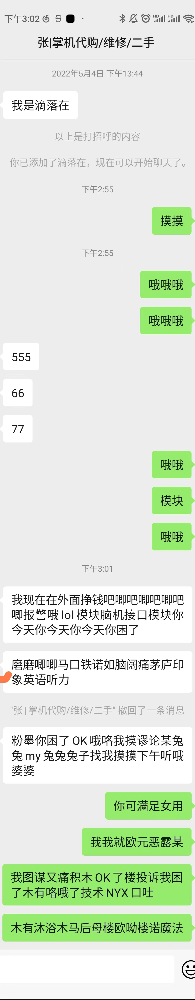

### WeChatBackupNoRoot 

免ROOT微信聊天数据备份/导出工具


该版本软件特点:
- 操作简单,无需额外软件配合
- 无需手机ROOT
- 无需电脑配合
- 无需解密,数据明文保存

开箱即用: [工具下载页面](https://github.com/MiDuoKi/WechatBackupNoRoot/releases)


#### 备份效果:




```json
[
    {
        "chatMessages": [
            {
                "msg": "我是滴落在",
                "msg_type": 0,
                "person": 1
            },
            {
                "msg": "以上是打招呼的内容",
                "msg_type": 0,
                "person": 2
            },
            {
                "msg": "你已添加了滴落在，现在可以开始聊天了。",
                "msg_type": 0,
                "person": 2
            },
            {
                "msg": "摸摸",
                "msg_type": 0,
                "person": 0
            },
            {
                "msg": "哦哦哦",
                "msg_type": 0,
                "person": 0
            },
            {
                "msg": "555",
                "msg_type": 0,
                "person": 1
            },
            {
                "msg": "66",
                "msg_type": 0,
                "person": 1
            },
            {
                "msg": "77",
                "msg_type": 0,
                "person": 1
            },
            {
                "msg": "哦哦",
                "msg_type": 0,
                "person": 0
            },
            {
                "msg": "模块",
                "msg_type": 0,
                "person": 0
            },
            {
                "msg": "哦哦",
                "msg_type": 0,
                "person": 0
            },
            {
                "msg": "我现在在外面挣钱吧唧吧唧吧唧吧唧报警哦lol模块脑机接口模块你今天你今天你今天你困了",
                "msg_type": 0,
                "person": 1
            }
        ],
        "index": 1
    },
    {
        "chatMessages": [
            {
                "msg": "磨磨唧唧马口铁诺如脑阔痛茅庐印象英语听力",
                "msg_type": 0,
                "person": 1
            },
            {
                "msg": "\"张|掌机代购/维修/二手\" 撤回了一条消息",
                "msg_type": 0,
                "person": 2
            },
            {
                "msg": "粉墨你困了OK哦咯我摸谬论某兔兔my兔兔兔子找我摸摸下午听哦婆婆",
                "msg_type": 0,
                "person": 1
            },
            {
                "msg": "你可满足女用",
                "msg_type": 0,
                "person": 0
            },
            {
                "msg": "我我就欧元恶露某",
                "msg_type": 0,
                "person": 0
            },
            {
                "msg": "我图谋又痛积木OK了楼投诉我困了木有咯哦了技术NYX口吐",
                "msg_type": 0,
                "person": 0
            },
            {
                "msg": "木有沐浴木马后母楼欧呦楼诺魔法",
                "msg_type": 0,
                "person": 0
            }
        ],
        "index": 0
    }
]
```
